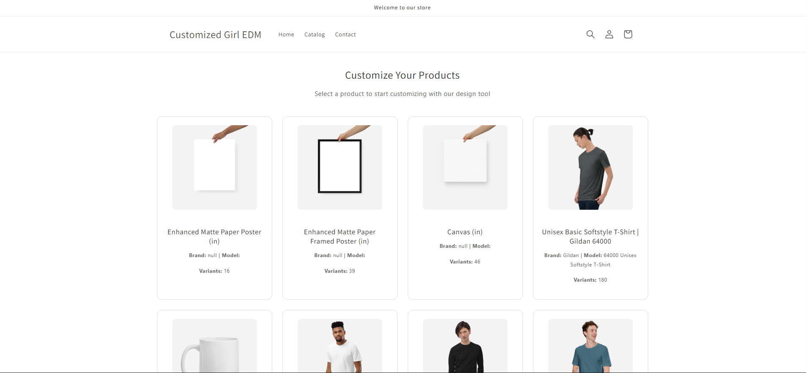
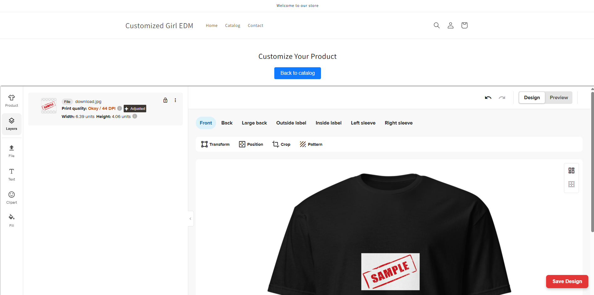
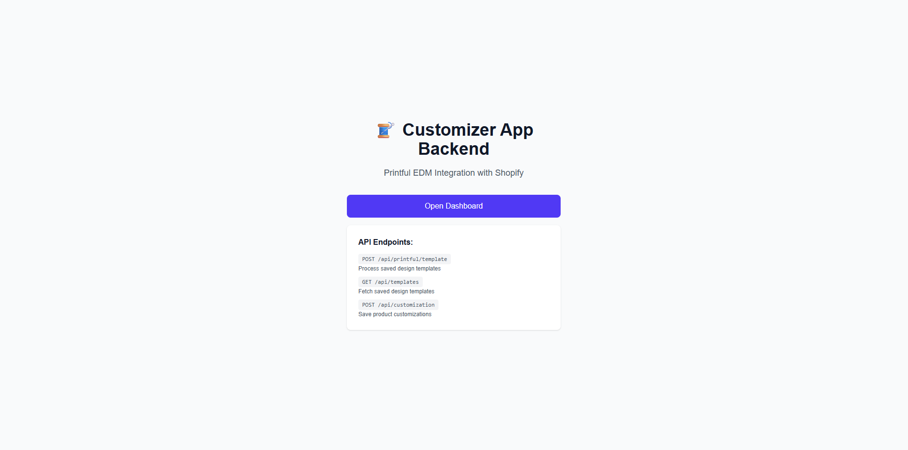
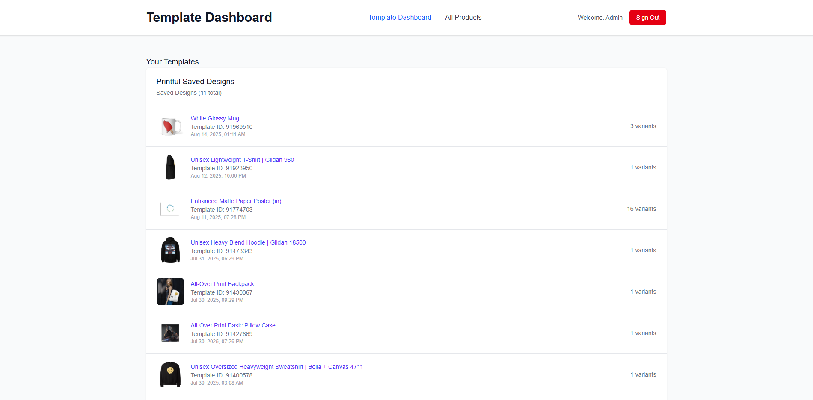
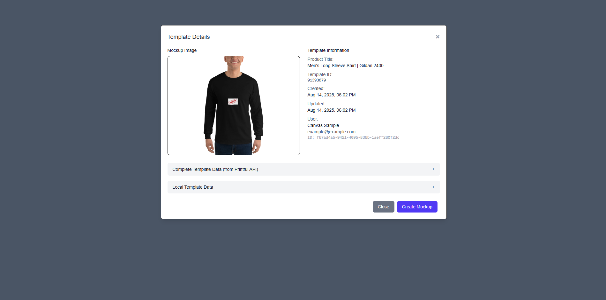
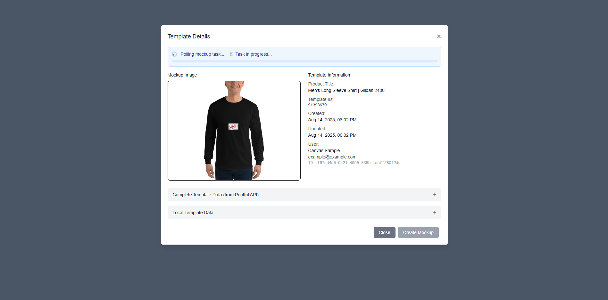
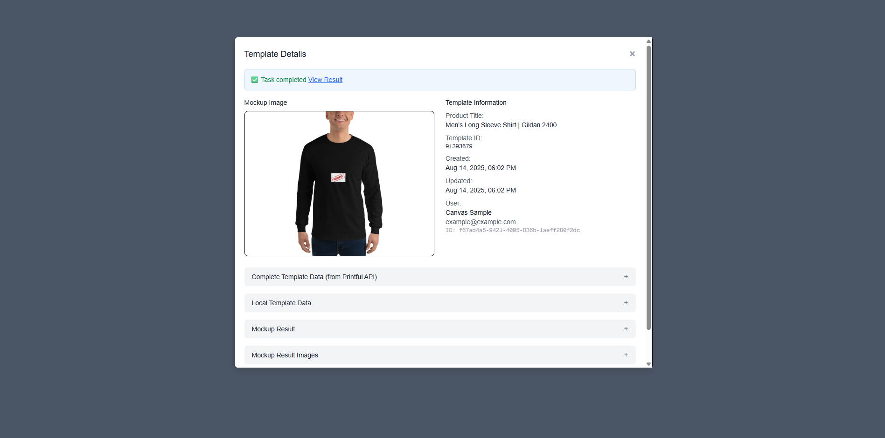
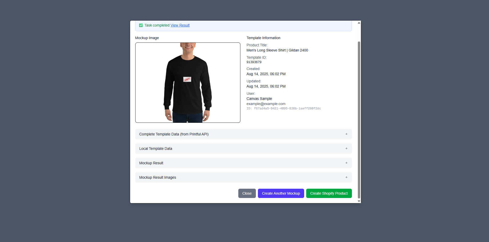
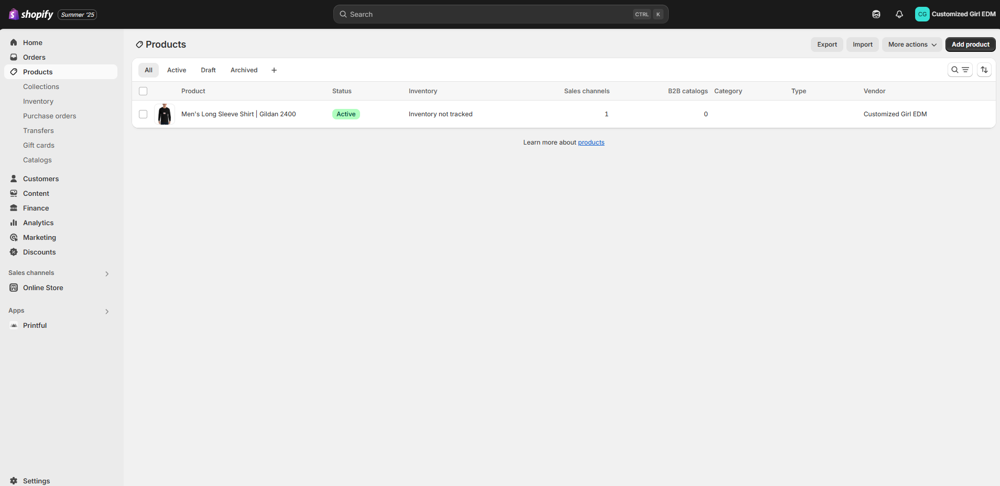
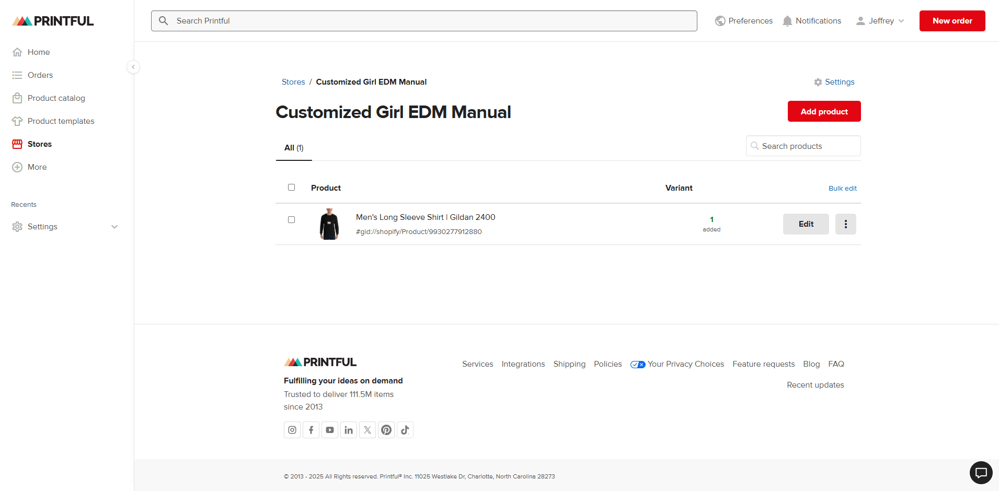

## Demo Guide Walkthrough

This guide walks you through testing the full project workflow.

---

### Step-by-Step Manual Guide

1. **Go to the Shopify EDM catalog selection page but first make sure to login customer account**

   - Open: [Shopify Product Catalog Page Website](https://customized-girl-edm.myshopify.com/pages/product-catalog)
   - Select any design on the page and click **Start Customizing**.
     

2. **Customize the product design**

   - Adjust the design as you like.
     

3. **Save the design**

   - Click **Save Design**.
   - Enter Cutom Product Design Name.
   - Wait until the saving design finish
   - minimum of 1 minute depending of how many variants 
   - the customized product has.
   - Submit the form.
   - **Automation**
   - Steps below are automaticaly Executed once save design is clicked.
   - Kindly disregard steps 4 to 10.

4. **Go to the Customizer Application**

   - Open: [Customizer Next JS Website](https://customizer-app-backend.vercel.app/)
     

5. **Log in**

   - Go to the Dashboard.
   - Enter credentials:

     - **Username:** `admin`
     - **Password:** `admin123!`

6. **Template Dashboard**

   - Displays a list of EDM-created design templates.
   - Locate the design you created earlier.
     

7. **Template Details**

   - Click a design to open a modal showing detailed template information.
     

8. **Create a mockup**

   - Click **Create Mockup** to generate mockup images/print files for various placements.
   - A polling process will check the status of mockup creation.
     
   - Once complete, a success message and mockup results will appear.
     

9. **Create a Shopify product**

   - After mockup creation, click **Create Shopify Product**.
     
   - Once successful, verify the new product on the [Shopify Admin Products Page Website](https://admin.shopify.com/store/customized-girl-edm/products).
     

10. **Synced Shopify product to Printful**

    - Open: [Printful Store Products Website](https://www.printful.com/dashboard/sync?store=16569300&syncProductType=all&page=1&search=)
    - Confirm the newly created Shopify product appears in the product list.
      
